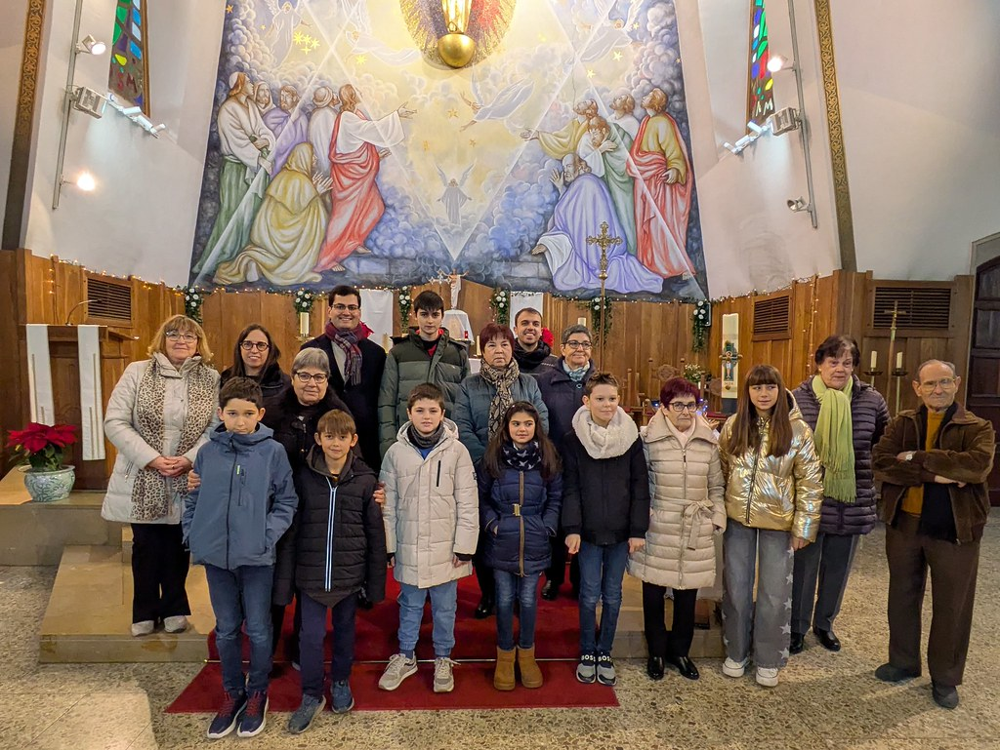

Com cada Nadal, s’ha celebrat el **Concurs de Pessebres d’Artesa de Segre**, que enguany arriba a la seva **70a edició**, una xifra que ens omple de joia i que confirma que el pessebre continua sent una tradició viva al nostre poble. El nostre objectiu, com sempre, és contribuir a mantenir aquesta bonica tradició que, més enllà de recordar el Nadal, **uneix generacions** en un projecte compartit i en una il·lusió que es renova any rere any.

Volem expressar el nostre agraïment a totes les persones i entitats participants: aquest any s’han presentat **16 pessebres**, amb una qualitat molt alta que ha fet especialment difícil la decisió del jurat. També volem donar les gràcies a la **Parròquia**, a l’**Associació de Comerciants i Serveis** i als **29 comerços i negocis col·laboradors**, que fan possible els premis i l’impuls del concurs.

## Novetat 70a edició: el Repte del Pessebre Perdut

En aquesta 70a edició hem volgut fer un pas més per reforçar la participació i els llaços de comunitat amb una iniciativa nova: **el Repte del Pessebre Perdut**. El repte consistia a buscar els **diorames elaborats a l’institut** i repartits per establiments del poble que, mitjançant **codis QR**, permetien completar un conte inèdit ambientat a Artesa a mesura que es recorrien els comerços.

Agraïm molt especialment a l’institut i a la professora **Montse Miralles** per haver col·laborat en aquest projecte creatiu i educatiu, així com a tots els comerços per la seva implicació. Properament, aquests diorames estaran exposats a la **Biblioteca d’Artesa de Segre**, on **l’Alba Alàs explicarà una versió reduïda del conte del Pessebre el divendres 16 de gener**.

## Pujada al Castellot

També volem agrair la participació en la **pujada al Castellot** per veure el pessebre, una iniciativa que ja és el segon any que es realitza i que estem contents de veure com es va consolidant.

## Guanyadors de la 70a edició

Finalment, gràcies a tothom qui ha votat el **Premi Popular**: enguany la participació ha estat tan elevada que s’han atorgat **dos premis populars**. Podeu trobar més informació i contingut del concurs a l’Instagram **@pessebres_artesa**.

**Premi Popular (doble)**
- **Emma Blasi** (406 vots)
- **Alexander** (367 vots)

**Premi a l’originalitat artística**
- **Teresa Solsona**

**Categoria Juvenil**
- **2n premi:** Roger Rey
- **1r premi:** Jan Sala

**Categoria Sènior**
- **2n premi:** Jaume Canes
- **1r premi:** Rosa Coma

## Fotos

Ja podeu veure totes les fotografies del concurs a Flickr:
- https://www.flickr.com/photos/204058871@N07/albums/72177720331337420

