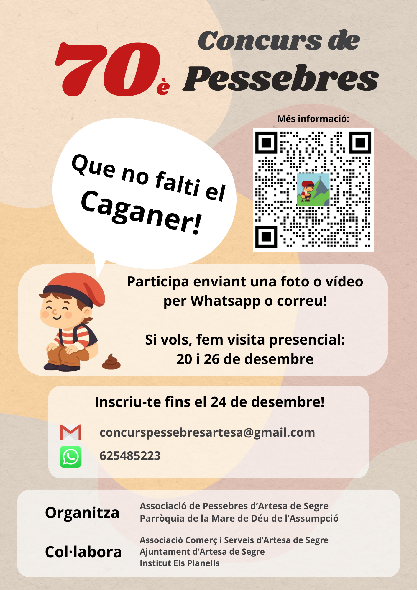

  

    
  

  

    
🎄 <strong>Ja tenim aquí les bases del 70è Concurs de Pessebres d'Artesa de Segre!</strong> 🎉

    
La nova edició del concurs ja està en marxa i <strong>les bases oficials ja són accessibles</strong>. Un any més, celebrem la creativitat, la tradició i la il·lusió d'aquestes festes amb un concurs obert a tothom del municipi.

    
📅 <em>Inscripcions: de l'1 al 25 de desembre de 2025</em> 
    🏆 <em>Dues categories: juvenil i adult, amb premis especials i Premi Popular</em> 
    📍 <em>Inscripció gratuïta via WhatsApp o correu electrònic</em>

    
Pots consultar totes les condicions, categories i criteris del jurat al document de bases: <a href="https://github.com/Pessebres-del-Segre/pessebres-del-segre.github.io/tree/main/assets/files/bases_70_concurs.pdf?raw=True">fent click a aquest enllaç</a>

    
<strong>Animeu-vos a participar-hi i a mantenir viva la màgia del pessebre!</strong> ✨

  

